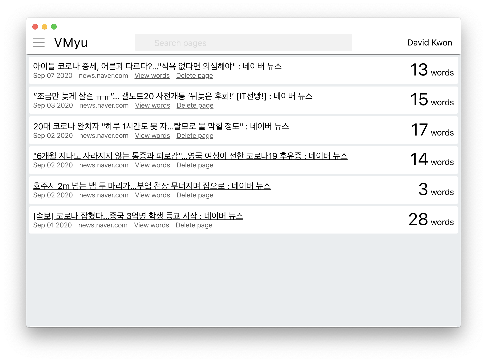
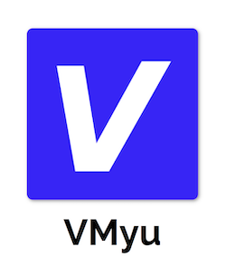
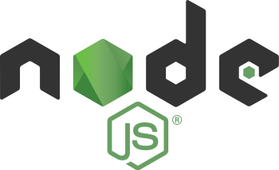
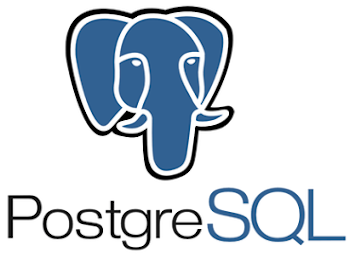
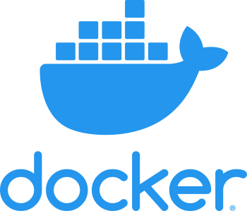
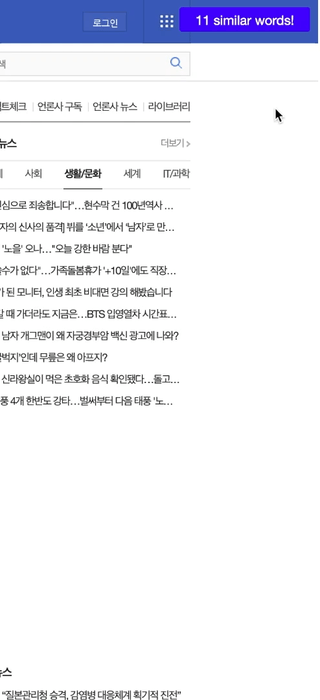

# VMyu - Improving your Korean vocabulary by reading the latest news articles

    

<table>
<tr>
<td vlign="center">
    
</td>
<td vlign="center">
    
</td>
<td vlign="center">
    
</td>
<td vlign="center">
    
</td>
<td vlign="center">
    
</td>
<td vlign="center">
    
</td>
<td vlign="center">
    
</td>
<td vlign="center">
    
</td>
<td vlign="center">
    
</td>
</tr></table>

## About
VMyu is a cross-platform desktop application and Google Chrome extension that makes it
easy to learn and keep track of new Korean vocabulary words from the latest news articles.

This repository contains code for the desktop application only.

### Why VMyu? What problem does VMyu solve?

I wanted an easy way to read and understand Korean news articles online.

I was tired of being unable to fully understand Korean movies and TV shows
due to my limited vocabulary.
Being raised in Toronto, I simply wasn't exposed to a wide variety of Korean
words in my everyday life. I tried reading Korean books, however, books are lengthy.
If I look up a word from page 3, chances are that I'll forget about it by the time
I reach page 57 when I see the same word again. Ideally when learning a new word,
I'd prefer to see the word again and again so that it can stay in my
long-term memory.

As a result, I focussed on news articles since they inform about current events/issues
and they are much shorter therefore easier to reread it over and over.

### Without VMyu
The image below depicts my workflow when reading the newspaper before developing VMyu.
Read, look up word, write definition, repeat.
It's messy and cumbersome to keep track of words and definitions while
using a dictionary on my laptop.

### With VMyu
VMyu transforms my workflow to new heights with a 100% online experience.
From Google Chrome, VMyu helps me quickly search and save word definitions, highlight,
and provide a hover modal over highlighted words.

If there is a word I don't know, I can highlight the word and search for its definition
using the context menu options provided by VMyu. I can then save the definition and
highlight the word within the article. Words, definitions and highlights are stored
in a database.

The "similar words" feature parses the current article's content and checks if it
contains words from all articles that I saved definitions for previously.
This encourages me to create long-term memories for these particular words, since
I am seeing the same word, but in different articles/contexts.

All saved words, definitions and the links to the news articles they came from,
can be accessed from the VMyu desktop application.
Words and their definitions can be edited as well, should they be inaccurate.
Once word definitions are edited, the changes are also available within the
article's highlight hover content.

## Structure
VMyu is a combination of three components: the desktop application, the Google Chrome
extension and the server to handle database requests. Each component communicates
with one another to provide the functionality explained above.

### Desktop application (Typescript, React, Redux, Electron)
 - Keeps track of saved articles, words and definitions
 - Search functionality for saved articles, words and definitions
 - Edit saved words and definitions
 - Cue card feature to help review words and their definitions

### Google Chrome extension (Typescript)
 - Seamlessly integrates with news websites (currently only supports [news.naver.com](https://news.naver.com))
 - Quickly search and save word definitions from [en.dict.naver.com](https://en.dict.naver.com/#/main)
 - Displays words that you may have seen before, helping you apply previous knowledge to new contexts
 - Highlight words within news articles, with a hover feature to display definitions

### Server (Typescript, Express.js, PostgreSQL, Docker)
 - REST API to handle database requests for creating/deleting articles, words, definitions and highlights

## Usage

As mentioned above, VMyu is a combination of three components: the desktop application,
the Google Chrome extension and the server to handle database requests.
This repository only contains source code for the desktop application.
If this project gets traction, I'll consider open sourcing the repositories for the Google Chrome extension and server.

[ReadLang](https://readlang.com) is a web application and Google Chrome extension that
offers a different, but in many ways, a similar workflow to VMyu, with support for about 60 languages.
In my experience, support for Korean is not as polished (its in beta mode) compared
to support for languages like English, French and Spanish.
This is mainly due to the fact that word spacing in Korean works differently.

## License

Licensed under the [GNU General Public License v3.0](LICENSE.md) license.